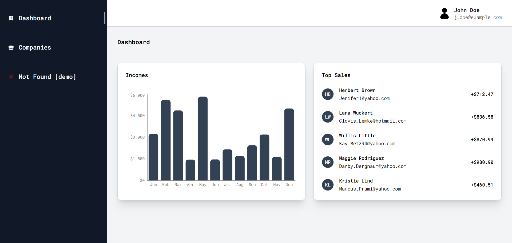

# Next.js + Tailwind CSS Admin Panel Demo

## Overview

This demo showcases a slice of an admin panel built using Next.js combined with the utility-first CSS framework Tailwind CSS and a collection of collection of re-usable components Shadcn UI. It includes a sidebar for navigation, routes to two main pages, and integrated chart and table components for data visualization and management.

## Features

- **Dynamic Chart**: Visually represent data.
- **Custom Label component**: Designed label setups.
- **Table and Data Fetching**: Display datasets with ease.
- **Navigation**: Smooth routing between simulated pages + responsive Header and Sidebar implementation.
- **Unit Testing with Vitest**: Comprehensive unit testing setup for ensuring code quality and reliability.

## Technologies

- **Next.js**: A React framework for building server-side rendered and statically generated web applications.
- **Tailwind CSS**: A utility-first CSS framework for quickly building custom designs without having to leave your HTML.
- **TanStack Query**: A data-fetching library for React that provides a powerful and flexible API for querying and mutating data from your server, with built-in caching and automatic refetching.
- **Shadcn UI**: A collection of re-usable components for faster development.
- **Vitest**: A unit testing library for JavaScript and TypeScript projects, providing a simple and intuitive interface for writing and running tests.
